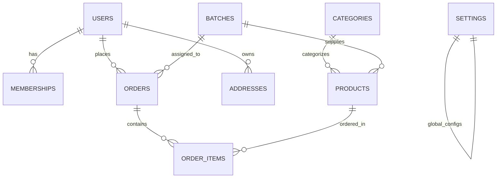

# Implementation Plan: Haridwar Bliss — Membership & Subscription E-Commerce Platform

This implementation plan is developed after thoroughly examining `Haridwar_Bliss_SOW.docx`. It details the architecture, visual theme overhaul, e-commerce workflows, membership subscription engine, batch traceability (QR code), and admin panel required to transform the current codebase into the **Haridwar Bliss** platform.

---

## 1. Project & Business Understanding (from SOW)

- **Brand & Domain**: **Haridwar Bliss** — an authentic spiritual e-commerce platform specializing in **Sacred Gangajal** sourced directly from Brahmakund / Har Ki Pauri in Haridwar, alongside related spiritual products (brass kalash, puja samagri, dhoop/incense, devotional items).
- **Core Membership Model**:
  - **One-Time Membership Fee**: ₹500 for a **5-year validity** (admin-configurable).
  - **Gated Access Control**: Non-members can browse the catalog, inspect lab certificates, and view the spiritual gallery, but **cannot** add to cart or checkout.
  - **Monthly Pricing Automation (Gangajal Subscription / Orders)**:
    - **1st Bottle**: Product Price = **₹0 (FREE)**, Shipping = **₹149 flat**.
    - **2+ Bottles**: 1st bottle is free, additional bottles charged at standard listed price; Shipping remains **₹149 flat per order**.
- **Traceability & Authenticity System**:
  - Every batch records: Batch number, collection date, source ghat (Har Ki Pauri / Brahmakund), packaging date, purity lab test report, video link, and status.
  - **Auto-generated QR Code & Barcode** per dispatched order encoding batch, order verification, and purity details.
  - Public QR verification page (`/verify/{code}`) allowing customers to verify the sacred provenance and lab report of their holy water.
- **Admin Control Panel**:
  - Analytical Dashboard, Product CRUD, Batch Management, Order Management with dispatch & invoice printing, Membership & Customer Management, Dynamic Pricing Settings (₹500 fee, ₹149 shipping, free product rule toggle), and Downloadable Reports (Sales, Members, GST).
- **External Integrations**:
  - **Razorpay** payment gateway (with sandbox/mock support for development/UAT).
  - **Shiprocket** logistics integration readiness (courier selection, tracking number capture, status sync).
  - Mail & SMS notification automation.

---

## 2. Visual & Cultural Theme Overhaul

The current generic indigo/slate theme will be transformed into a **sacred, premium Indian spiritual aesthetic**:
- **Palette**:
  - **Sacred Saffron & Surya Amber** (`amber-600` / `#D97706`, `orange-500` / `#F97316`)
  - **Temple Vermilion & Sacred Maroon** (`rose-900` / `#881337`, `red-800` / `#991B1B`)
  - **Holy Ganga River Azure / Cerulean** (`sky-700` / `#0369A1`, `cyan-600` / `#0891B2`)
  - **Divine Temple Gold Accents** (`amber-400` / `#FBBF24`, metallic gold gradients)
  - **Ivory, Sandalwood & Cream Backdrops** (`amber-50/40`, `stone-50`, `#FFFDF7`)
- **Visual Elements**:
  - Devotional motifs: Diya flame, sacred lotus, Gangotri/Himalayan mist, ghat steps, holy water droplet.
  - Prominent "100% Pure Brahmakund Gangajal · Untouched Bottling · Lab Certified" trust badges.

---

## 3. Database Architecture (Migrations & Models)

### New Tables to Create:
1. **`memberships`**:
   - `id`, `user_id` (foreign key to `users`), `status` (`active`, `expired`, `pending`), `fee_paid` (decimal), `starts_at` (datetime), `expires_at` (datetime), `payment_id`, `payment_method`, timestamps.
2. **`categories`**:
   - `id`, `name`, `slug`, `description`, `image`, `is_active`, `sort_order`, timestamps.
   - *Default categories*: Pure Gangajal, Brass Pooja Vessels, Sacred Incense & Dhoop, Haridwar Souvenirs & Prasad.
3. **`batches`**:
   - `id`, `batch_number` (unique, e.g., `HB-GANG-2026-001`), `collection_date`, `sourcing_ghat` (e.g., Har Ki Pauri / Brahmakund), `packaging_date`, `purity_notes`, `lab_certificate_path`, `video_url`, `status` (`ready`, `dispatched`, `archived`), timestamps.
4. **`products`**:
   - `id`, `category_id`, `name`, `slug`, `short_description`, `description`, `price` (regular), `member_price` (discounted/free rule), `is_gangajal` (boolean), `volume_ml`, `stock`, `images` (json), `video_url`, `purity_details` (text), `specifications` (json), `is_active`, `is_featured`, timestamps.
5. **`addresses`**:
   - `id`, `user_id`, `type` (`shipping`, `billing`), `recipient_name`, `phone`, `address_line1`, `address_line2`, `city`, `state`, `postal_code`, `is_default`, timestamps.
6. **`orders`**:
   - `id`, `order_number` (unique, e.g., `HB-ORD-2026-1001`), `user_id`, `batch_id` (nullable, linked to Gangajal batch), `subtotal`, `discount`, `shipping_fee`, `total_amount`, `payment_status` (`pending`, `paid`, `failed`), `payment_method` (`razorpay`, `cod`, `mock`), `payment_id`, `order_status` (`placed`, `confirmed`, `batched`, `dispatched`, `in_transit`, `delivered`, `cancelled`), `tracking_number`, `courier_name`, `qr_code_token`, `shipping_address` (json), `billing_address` (json), `notes`, timestamps.
7. **`order_items`**:
   - `id`, `order_id`, `product_id`, `product_name`, `price`, `quantity`, `total`, `is_free_monthly_item` (boolean), timestamps.
8. **`site_settings`**:
   - `id`, `key` (unique), `value`, `description`, timestamps.
   - Defaults: `membership_fee = 500`, `membership_validity_years = 5`, `shipping_charge = 149`, `free_first_bottle_enabled = true`.
9. **`user` modification**:
   - Add `phone`, `is_admin` (boolean default false).

---

## 4. Proposed Implementation Phases

### Phase 1: Branding, Settings & Database Layer
- Set `APP_NAME="Haridwar Bliss"` in `.env` and `config/app.php`.
- Create migrations for `memberships`, `categories`, `batches`, `products`, `addresses`, `orders`, `order_items`, `site_settings`, and user fields.
- Create Eloquent Models with relationships: `User`, `Membership`, `Category`, `Batch`, `Product`, `Address`, `Order`, `OrderItem`, `SiteSetting`.
- Create Database Seeders with realistic data:
  - Default Site Settings (₹500 membership, ₹149 shipping, 5-year validity).
  - Sacred Categories (Gangajal, Brass Ware, Pooja Items, Haridwar Gifts).
  - Authentic Gangajal products (500ml Sacred Glass Bottle, 1L Brass Cask, 5L Temple Jerrycan) + Brass Diya & Aarti Kalash.
  - Sample Brahmakund verified Batch with lab certification data.
  - Admin user (`admin@haridwarbliss.com`).

### Phase 2: Public Website & Sacred Devotional Frontend
- **Sacred Theme System**: Custom Tailored CSS / Tailwind with saffron, gold, and Ganga blue tokens.
- **Homepage (`/`)**:
  - Hero with Haridwar ghats aura, Ganga Aarti blessing, and direct CTA: "Join 5-Year Membership (₹500)" & "Explore Sacred Offerings".
  - **About Haridwar Bliss**: Purity of Brahmakund water, touch-free hermetic bottling.
  - **The 5-Year Membership Journey**: Visual 3-step explanation:
    1. Join for ₹500 (Valid 5 Years)
    2. Order your monthly Sacred Gangajal (1st bottle free, ₹149 delivery)
    3. Scan your order's QR code to verify batch collection & purity lab report.
  - **Featured Products**: Cards with dual pricing (Member Price vs Non-Member Price) and "Member Exclusive" tag.
  - **Batch Purity & Lab Certificate Showcase**: Interactive preview of laboratory test results (pH balance, dissolved oxygen, microbial purity).
  - **Video & Image Gallery**: Har Ki Pauri Aarti, Brahmakund collection, bottling.
  - **Customer Reviews & Testimonials**.
  - **FAQ Section** (addressing shelf life of Gangajal, delivery timeline, membership benefits).
  - **Contact Us & Haridwar Office Map**.
- **Product Catalog (`/products` & `/products/{slug}`)**:
  - Filter by category, view purity specifications, volume, and high-res imagery.
  - Add-to-cart access gate for non-members with an informative prompt.
- **Static Pages**: About Us, FAQs, Contact Us, Terms & Conditions, Privacy Policy.

### Phase 3: Membership Engine & Access Control
- **Membership Purchase Flow (`/membership/join`)**:
  - Explanation of 5-year benefits and ₹500 fee.
  - Checkout & payment integration (Razorpay ready + Instant Sandbox/Mock activation).
  - Automatic creation of active membership record with 5-year expiration date.
- **Access Control Middleware**:
  - Allows non-members to browse catalog, but intercepts add-to-cart/checkout with a modal/banner: *"Exclusive to Haridwar Bliss Members. Join our 5-Year Sacred Membership for ₹500 to unlock monthly Gangajal orders."*
  - Dedicated Customer Dashboard (`/my-account` or `/dashboard`) displaying:
    - Active Membership Card with 5-Year Validity badge and expiry countdown.
    - Quick "Claim Monthly Gangajal" action.
    - Order History with tracking and downloadable invoices.
    - Saved Addresses.

### Phase 4: E-Commerce Shopping Cart & Pricing Automation
- **Automated Pricing Rules**:
  - When an active member adds Gangajal:
    - 1st bottle: **₹0** (Free Monthly Bottle).
    - 2+ bottles: Additional bottles at listed price.
    - Shipping: Flat **₹149** per order.
  - Cart page (`/cart`): Dynamic summary breaking down: Subtotal, Member Free Bottle discount, Shipping (₹149 flat), Total.
- **Multi-Address Checkout (`/checkout`)**:
  - Address selection or new address form with pincode, city, state.
  - Order summary with purity guarantee badge.
  - Payment options (Razorpay / Mock Sandbox / Cash on Delivery).
  - Order success page with order number, batch assigned, and generated QR code.

### Phase 5: Batch Traceability & QR Code System
- **QR Code & Barcode Generation**:
  - Generate a secure unique verification token / URL for every dispatched order.
  - SVG/PNG QR code displayable on the order confirmation page, customer dashboard, and printed invoice.
- **Public Verification Portal (`/verify/{token}`)**:
  - Anyone scanning the bottle's QR code sees:
    - Verified Genuine Brahmakund Origin.
    - Sourcing Ghat: Har Ki Pauri, Haridwar.
    - Exact Water Collection Date & Packaging Date.
    - Lab Test Certificate details (pH 7.8, zero pathogens, natural mineral profile).
    - Video link of the Haridwar collection/Aarti ceremony.
    - Order & dispatch confirmation.

### Phase 6: Comprehensive Admin Control Panel (`/admin`)
- **Admin Authentication & Middleware**:
  - Restricted to admin users (`is_admin = true`).
- **Dashboard & KPIs**:
  - Total registered users, active vs expired members, total orders, monthly revenue, monthly subscriptions, recent orders table.
- **Product Management**:
  - Create, edit, list, and delete products; upload images; specify volume and purity notes.
- **Batch Management**:
  - Create new batches with batch code, collection date, ghat location, lab certificate attachment, and video URL.
- **Order Fulfillment & Logistics**:
  - View incoming orders, assign batch, generate dispatch QR code, update status (Confirmed -> Batched -> Dispatched -> Delivered), add Shiprocket tracking number.
  - Print/download official Packing Slip & Invoice.
- **Membership & Customer Management**:
  - List members, view 5-year expiry dates, manually toggle status or extend validity.
- **Dynamic Pricing & Rules Manager**:
  - No-code admin form to adjust Membership Fee (₹500), Shipping Flat Rate (₹149), and toggle Free First Bottle rule.
- **Reports Module**:
  - View and export Sales, Membership, and GST reports (CSV / Print / PDF view).

---

## 5. Verification Plan

### Automated Tests
- Feature tests for:
  1. `MembershipPurchaseTest`: Non-member purchases 5-year membership for ₹500, verifies membership is activated with correct 5-year expiry.
  2. `MembershipAccessControlTest`: Non-member cannot add to cart / checkout; active member can.
  3. `MonthlyPricingRuleTest`: 1 bottle of Gangajal is ₹0 + ₹149 shipping; 2 bottles are 1 free + 1 charged + ₹149 shipping.
  4. `BatchTraceabilityTest`: Order receives batch assignment and QR token; `/verify/{token}` resolves correctly with batch purity data.
  5. `AdminAccessTest`: Regular user cannot access `/admin`; admin user can manage products, batches, and pricing settings.

### Manual & UI Verification
- Browser testing of the full spiritual theme across Desktop, Tablet, and Mobile.
- Test membership purchase flow and simulated payment.
- Test adding 1 bottle (verify ₹0 + ₹149 shipping) and 2 bottles (verify 1 free + 1 charged + ₹149 shipping).
- Test QR code scanner navigation to the authenticity page.
- Test Admin panel dashboard, batch creation, product management, and dynamic pricing settings change.
